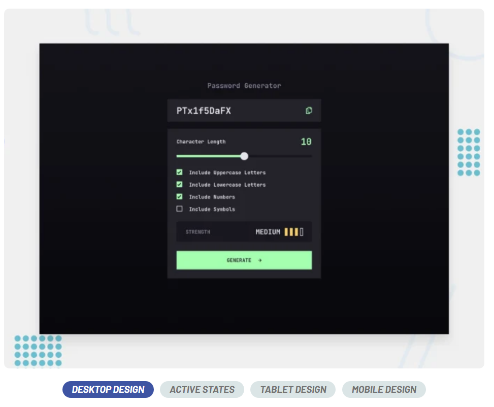
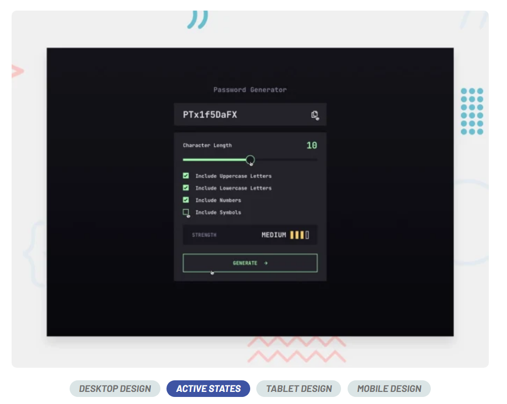
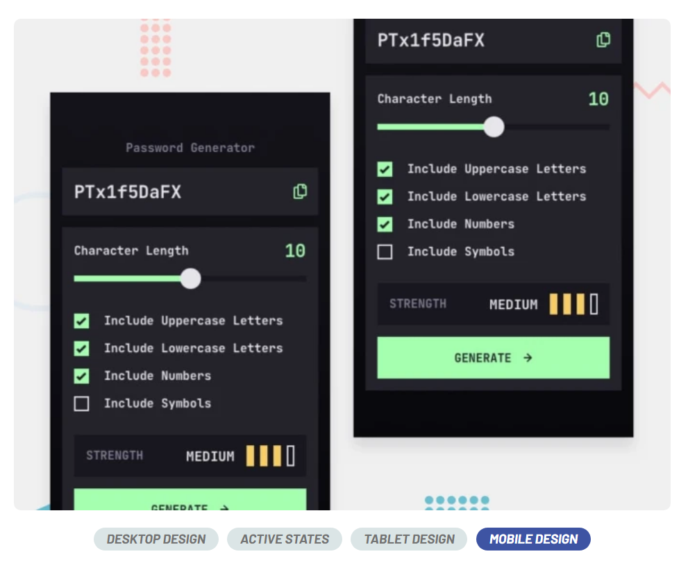

# Vue 3 + Vite 🚀
## Password generator app 💰

This app will be an excellent test of your HTML, CSS, and JS skills. You'll build custom form controls and use JavaScript to generate random passwords.

 🖥️
 💻
 📱

📝 Brief
Your challenge is to build out this password generator app and get it looking as close to the design as possible.

You can use any tools you like to help you complete the challenge. So if you've got something you'd like to practice, feel free to give it a go.

Your users should be able to:

-Generate a password based on the selected inclusion options
-Copy the generated password to the computer's clipboard
-See a strength rating for their generated password
-View the optimal layout for the interface depending on their device's screen size
-See hover and focus states for all interactive elements on the page

[live version](https://github.com/Yonerfy/password-generator)👨🏾‍💻
